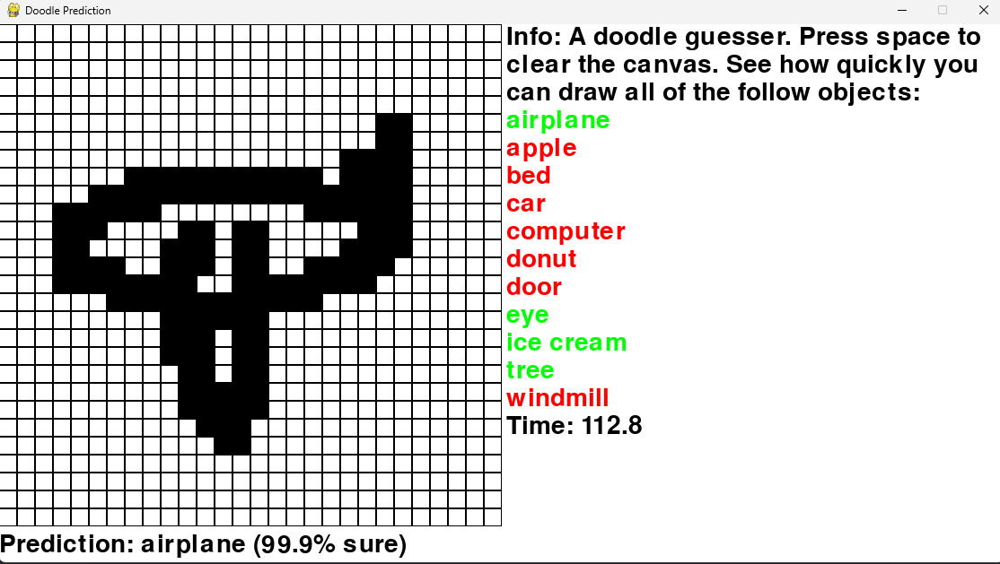

<!-- PROJECT LOGO -->
<br />
<div align="center">
  <a href="https://github.com/Mihir-A/Chess-AI">
    
  </a>

<h3 align="center">Doodle Guesser</h3>

  <p align="center">
    A drawing game where the player has to draw the specified classes as fast as possible. The computer can guess classes using a Convolutional Neural Network(CNN).
  </p>
</div>

<div align="center">
  
</div>


<!-- USAGE EXAMPLES -->
## Usage
* Run DoodleGuesser.py
* Attempt to draw the doodles as quickly as possible.

## Features
* Guessing is done with a Convolutional Neural Network with 93387 parameters
* Model can classify images to 1 of 11 classes with a > 95% accuracy
* Easy to add more classes and recompile model


<!-- GETTING STARTED -->
## Building from scratch
  
### Prerequisites

* Python (Built with Python 3.10.11)
* Tensorflow (Built with TF version 2.9.0)
* Numpy (Built NP version with 1.25.0)
* Pygame (Built with pygame 2.5.0)
  
### Installation

1. Install [Python 3.10.11](https://www.python.org/downloads/release/python-31011/)
2. Clone the repo
   ```sh
   git clone https://github.com/Mihir-A/Doodle-Guesser.git
   cd Doodle-Guesser
   ```
3. Install necessary libs
   ```sh
   python3 -m pip install tensorflow numpy pygame
   ```
4. Download more class data from [Google Quickdraw](https://console.cloud.google.com/storage/browser/quickdraw_dataset/full/numpy_bitmap) if desired
5. Use modelCreator.ipynb to create a new model. Required if new classes have been added.
6. Run doodleGuesser.py
   ```sh
   python3 doodleGuesser.py
   ```

## Screenshots
<p float="left">
  
</p>


<!-- LICENSE -->
## License

Distributed under the MIT License. See `LICENSE.md` for more information.


<!-- CONTACT -->
## Contact

mihiranan@gmail.com

Project Link: [https://github.com/Mihir-A/Doodle-Guesser](https://github.com/Mihir-A/Doodle-Guesser)


<!-- ACKNOWLEDGMENTS -->
## Acknowledgments
* [Google Dataset](https://console.cloud.google.com/storage/browser/quickdraw_dataset/full/numpy_bitmap)

<p align="right">(<a href="#readme-top">back to top</a>)</p>
